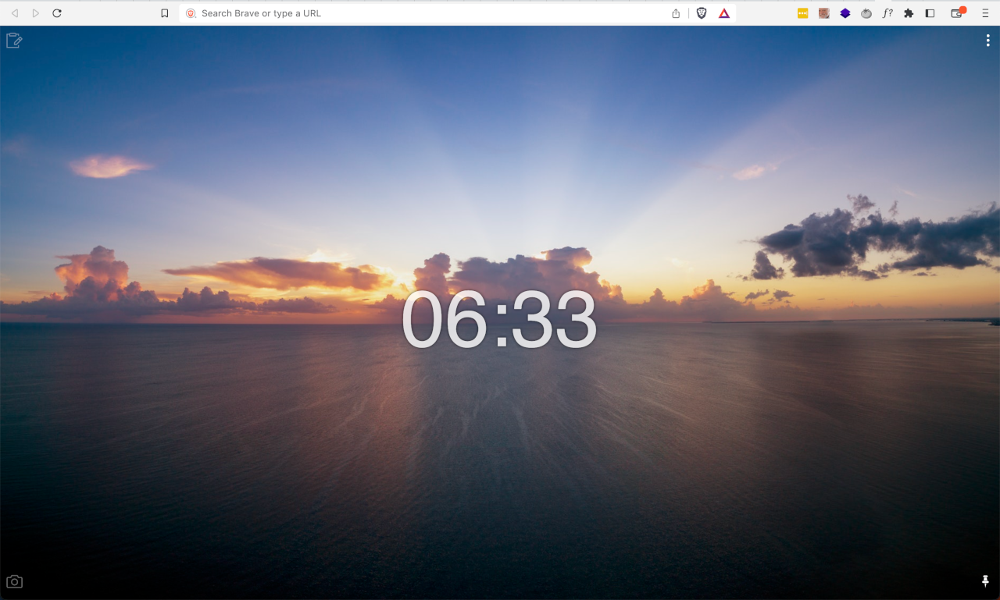
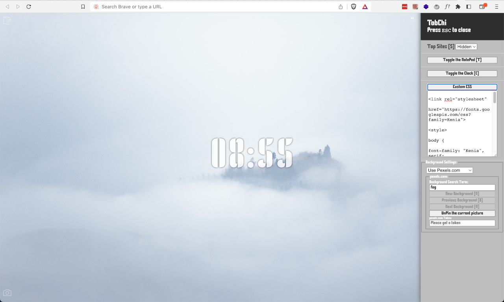

# TabChi

_An simple and highly customizable open source new tab plugin for Geeks._

Take charge of your new tabs page and create a personalized dashboard that's tailored to your needs.

Lets redefine the meaning of new tab page. You can install TabChi from below links:

- [Google Chrome](https://chrome.google.com/webstore/detail/tabchi/hejohfomoahmhoiboehdenbolpheiofo)

TabChi is an open-source Google Chrome extension that allows you to customize your new tab page to your heart's content. With TabChi, you can choose from a diverse selection of themes, including travel destinations, cuisines, landscapes, and much more. Each time you open a new tab, you'll be greeted by a stunning image that matches your chosen theme.

But that's not all. TabChi offers an array of features designed to enhance your browsing experience, including:

- Quick access to your favorite websites and bookmarks
- A convenient notepad for jotting down notes on-the-go
- A handy clock to keep you punctual
- Custom CSS capabilities for the perfect look and feel

And now, with the latest version of TabChi, we've added even more features:

- Weather Forecast: Get weather updates for your desired city directly in the new tab page.
- Web UI AI Chat: Chat with ChatGPT within the new tab page using a web UI, making it easy to get quick answers to your questions.
- Shortcuts: Define short keys to fast jump to your desired URLs, improving your productivity and making your browsing experience more keyboard-friendly. Just add the > sign in the address bar, press space, use the short key, hit enter, and you're on your way!

But what sets TabChi apart is its highly customizable nature. With TabChi, you can tailor your new tabs to your desires and even develop a muscle memory for frequently visited sites. And who knows? You may even experience the IKEA effect, where the act of customization makes your new tab page feel even more valuable to you.

Don't settle for a dull new tab page. Install TabChi now and transform your browsing experience with a visually stunning, custom-tailored dashboard that's distinctly yours.

## Development

Here we are following this rules:

- I am a newbie in frontend technologies and I like to keep this newbie friendly, so [KISS](https://en.wikipedia.org/wiki/KISS_principle) it :D
- Using only Jquery and keeping it like the old web of the 90s and 00s :)
- Enjoy what you are doing and don't think about people opinions ;)

To develop and test this plugin on Google Chrome please clone this repository on your machine and copy manifest.json from chrome folder to the root folder:

```
git clone git@github.com:pesarkhobeee/TabChi.git
cd TabChi

```

then inside of address bar go to
`chrome://extensions`
Click on `Load unpacked` and choose the gt folder, now you can see the details, errors and test the extention.

### Thanks to:

- https://www.flaticon.com/free-icon/windows_4116315?term=tab&page=2&position=66&origin=search&related_id=4116315

### TODO:

- Fix openAI setting window bug
- Add pre-commit check
- Add on boarding
- check code qulities
- Add Community CSS
- Add tooltip for menu items
- divide dashboard.js to something better [X]
- rename actions.js to ui-actions.js [X]
- update jquery
